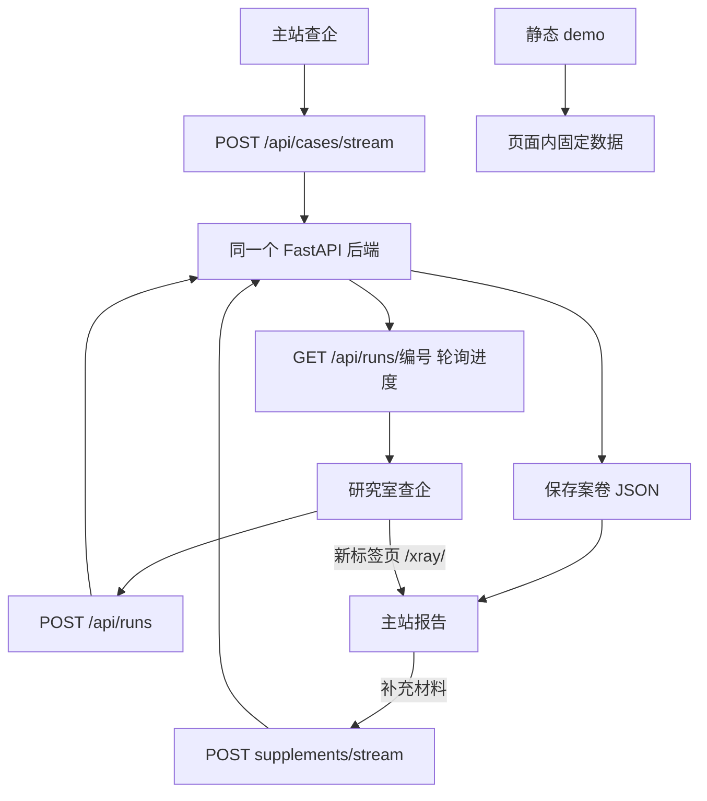

# 前端结构排查记录（2026-10-02）

目前的产品形态是：**一套完整的查企主站 + 一套独立的研究室动画入口 + 一套静态演示备用页，共用主站后端能力的部分尚未完全统一。**

本次检查了三个前端目录、路由、页面组成、数据流、后端挂载、开发代理、运行中的接口版本，以及浏览器中的桌面与手机布局。只新增此记录，没有修改业务代码，没有删除文件。

## 1. 三套前端分别是什么

| 目录 | 实际职责 | 实现方式 | 入口 |
|---|---|---|---|
| `web/` | 完整业务主站：查询、案卷、报告、版本、证据、小企问答、评价、打印 | 原生 HTML / CSS / JS，后端直接提供文件 | 后端根路径 `/` |
| `research-room/` | 查询公司、展示研究动画、查询任务恢复、打开主站报告 | React 19 + TypeScript + Vinext / Vite，使用 Next 风格的 app 目录；不是由标准 Next CLI 启动 | 独立开发服务，通常 3000 |
| `demo/` | 固定虚构案例的六步演示，适合离线展示 | 一个包含样式、脚本和固定数据的 HTML | 后端 `/demo/`，也能独立静态托管 |

`research-room` 只有一个业务页面 `app/page.tsx`。其 `components/ui/` 中有 60 个组件文件，但业务页面直接使用的只有 Button、Input；组件库数量不能用来判断实际页面数量。

后端只把 `research-room/public/` 挂到 `/research-assets/` 共享图片，并没有把整个 React 研究室挂到主站。

依据：`backend/app/main.py:357`、`research-room/package.json`、`research-room/app/page.tsx:17`。

## 2. 主站页面地图

```text
企er 主站
├─ 查企  #/check（空地址、#/ 也进入这里）
│  ├─ 公司全称 + 需求
│  ├─ 场景识别与手动选择、替谁看、金额
│  ├─ 可选宣传单 / 合同 / 聊天记录，支持文字与上传
│  ├─ 演示案例填入
│  └─ 提交 → 内嵌等待动画 → 最新报告
├─ 案卷  #/cases
│  └─ 单份案卷  #/case/<id>
│     ├─ 历史版本  #/case/<id>/v/<n>
│     ├─ 一眼看懂：第一问、说法对照、四个信号摘要、下一步
│     ├─ 文字版：给家人 / 给网点柜员，支持打印
│     ├─ 用图看：只在报告有相应图表数据时出现
│     ├─ 详情标签：变化 / 四个信号 / 宣称 vs 记录 /
│     │           该问对方的 / 原始数据 / 评价
│     ├─ 原文、名词解释弹层
│     ├─ 补充信息 / 拍合同二次审核 → 同一案卷的新版本
│     └─ 小企问答，引用绑定相应报告版本
└─ 我的  #/me
   └─ 模型和数据源状态、名单、名词、材料存放说明、使用原则
```

报告不是第四个一级分区，它是案卷的详情。评价是报告里的标签；小企是共享侧栏，窄屏下收成浮动按钮；补充材料和看原文都是弹窗。它们并不是独立路由页面。

“变化”只在第二版起显示。“判断”是隐藏标签，需要在 `#` 前的查询参数里加 `?judg=1`；代码注释明确说明这部分存在判断更新语义问题，因此没有正式开放。

依据：`web/app.js:25`、`:28`、`:33`、`:509`、`:739`、`:1572`。

## 3. 研究室页面地图

```text
研究室 /
├─ 初始状态：公司全称 + 可选研究需求
├─ 查询中：输入框隐藏，办公室动画、五类资料标记、真实进度
├─ 动画控制：暂停 / 继续、动作详情、切换公司
├─ 完成：查看报告 → 新标签页 /xray/#/case/<id>
├─ 异常：查看已保存案卷 / 确认后重新查询
├─ ?run=<编号>：刷新后继续查看同一次任务
└─ 本地 ?animationTest=fast 等：合成事件测试，明确标记非真实查询
```

五类资料标记是资料来源分组，不是五个业务页面：企业资料、图书年报、政府公告、经营数据、社会舆情。

研究室没有案卷导航、我的、材料上传、完整报告、评价和小企问答。其需求可以不填，空值会使用通用研究需求；主站的查询表单则围绕具体使用场景组织。这两个入口目前承载的能力不同。

暂停只暂停动画，后端仍继续处理。“切换公司”重置前端状态，也不等于撤销后端任务。

依据：`research-room/app/page.tsx:111`、`:344`、`:405`；`app/use-office-research.ts:19`、`:158`。

## 4. 静态演示的六步

`demo/index.html` 的步骤是：建案卷 → 透视宣传单 → 四个信号 → 新材料 → 替你追问 → 给家人的一页。

它演示的是一个预先写好的故事。页面中使用固定案例和浏览器内状态，不是当前后端案卷系统的另一种导航。六个步骤均已在浏览器打开核对。

## 5. 数据究竟怎么走



主站采用 NDJSON 进度流：后端逐行返回进度，最后返回案卷；研究室正常查询采用任务编号和轮询，任务号保存在地址栏。研究室的合成测试仍走模拟的流式分支。

两边复用数据契约和后端规则，并没有复用同一个页面壳、路由系统、进度客户端或动画控制器。

`research-room/vite.config.ts` 在开发模式下代理 `/api` 到后端，并把 `/xray/` 去掉前缀转发到后端主站。主站自己的 API 使用根路径 `/api`，因此经过研究室代理后仍可访问。

数据概念需要分开理解：

- **公司**是查询对象，同一家公司可以产生多份案卷。
- **案卷**是一次查询及其后续材料、报告版本和聊天的集合，保存在后端机器；默认一个案卷一个 JSON 文件。
- **版本**是案卷内的一次报告快照。补充材料、对方回复、改需求或纳入新评价会生成新版本。
- **评价**按公司存放，浏览器匿名编号区分作者；不是登录用户中心，也不是天然属于某一版报告。
- **研究任务 run**是后台生成工作的编号，和案卷 id 不是同一件事。

当前没有登录和按用户隔离的案卷列表。“我的”不代表私人账户空间；访问同一后端的浏览器读取该后端的案卷列表。

## 6. 已确认的问题与影响

| 优先级 | 发现 | 证据与影响 |
|---|---|---|
| 高 | 本机后端版本混用 | 检查时 8010、8020 的 OpenAPI 均没有 `/api/runs`、`/api/cases/stream`；8031 有。8010/8020 的研究图片路径返回 404，8031 返回 200。8010 报告的评价标签实测显示“评价没读出来：Not Found”。旧进程能提供最新静态前端，却仍运行旧 Python 接口，出现了“页面正常、部分功能失败”。 |
| 高 | 研究室手机布局不可直接当主站首页使用 | 375×812 浏览器实测，整个 16:9 场景缩成屏幕中间约 211px 高的横条，上下留黑，资料标记、需求输入与画面拥挤。原因见 `globals.css:93` 至 `:111` 的固定视口、横屏比例和裁切。 |
| 高 | 经研究室打开主站后，等待动画资源缺失 | 开发代理只包含 `/api` 和 `/xray/`。主站 CSS 以绝对路径加载 `/research-assets/research-room-v2.png`、`/research-assets/goose-actions-v2.png`，研究室对应路径实测 404；新后端同路径 200。因此从研究室进入主站后再新建或补充材料，等待动画背景和角色会缺图。 |
| 中 | 两个查询入口没有统一导航 | 研究室首页无法直接进入案卷列表；报告在新标签页打开；主站没有回到研究室的导航。用户很难判断哪个才是首页。依据 `page.tsx:405` 和主站 NAV。 |
| 中 | 同一个等待阶段维护两份实现 | 主站使用 `web/research-progress.js/css`；研究室使用 `research-events.ts`、`use-office-research.ts`、`office-director.ts`、`office-motion.ts`。仅共享部分图片与后端协议，行为会逐渐分化。 |
| 中 | 刷新恢复能力不一致 | 研究室有 `?run=` 恢复；主站的一次性流中断后只能提示查看案卷，无法恢复原等待页。 |
| 中 | “我的”商业数据额度显示字段错误 | 浏览器显示“最多调用 0 次，已用 0 次”。前端读取 `max_calls/calls`，企查查智能体后端实际返回 `max_points/points`。缺字段被 `|| 0` 变成了 0，且“次数”和“积分”单位不一致。依据 `web/app.js:302`、`qcc_agent.py:294`。 |
| 中 | “公司数”与“案卷数”混淆 | 首页用 `S.cases.length` 显示“你查过 N 家”，实际统计案卷数量。实测列表中同一公司重复出现，所以 20 份案卷不代表 20 家公司。依据 `web/app.js:255`。 |
| 中 | 文档未准确描述当前研究室接入方式 | README 概括为真实进度流，前端交接仍保留“独立动画原型、未修改页面逻辑”的阶段描述；实际研究室已接 `/api/runs` 和恢复逻辑。“尚未整体迁入主站”仍然成立，但原型的功能状态需要更新。 |
| 低 | 产品界面夹杂开发说明 | 案卷页直接解释“列表接口缺字段”，我的页展示服务器文件路径和密钥存放方式；这些内容增加普通用户理解负担。 |
| 低 | 主站代码高度集中 | `web/app.js` 1602 行，包含路由、表单、报告、图表、评价、问答、弹窗和打印。局部调整容易影响其他区域。 |
| 待验证 | 正式部署是否具备同等代理能力 | 仓库内明确看到的转发在 Vite `server.proxy`，属于开发配置。未验证线上环境，不据此断言线上不可用；发布前需验证 `/api`、`/xray/`、`/research-assets/`。 |

以上的高优先级针对当前整合体验和可运行性，不是对所有页面或后端能力的否定。

## 7. 已做的验证及边界

- 阅读三个前端的页面入口、路由与核心交互；核对后端静态挂载、案卷存储和模型契约。
- 浏览器查看主站查企、案卷、已有多版本报告、六个公开详情标签、补充信息弹窗和我的；核对研究室桌面与手机首页；打开静态演示全部六步。
- 研究室使用明确标记的 `animationTest=fast` 合成事件，验证查询状态、资料覆盖、保存确认与“查看测试结果”。它不证明真实外部数据服务的完整链路。
- 主站 27 项 Node 回归测试通过；研究室 13 项测试通过。
- 本机 Node 是 22.16.0；研究室直接执行包里的默认 `npm test` 对应命令会因 `.ts` 扩展名失败，加 `--experimental-strip-types` 后 13 项通过。包声明的 Node 下限与默认测试脚本存在兼容性缺口。
- 对三个已有后端进行了只读 OpenAPI / 资源检查，对研究室代理进行了 HTTP 检查。
- 没有新建真实案卷、提交用户评价或发起付费模型 / 商业数据查询；没有重新验收打印页数、文件上传识别和线上部署。

排查时为研究室临时启动了开发预览，并接到现有 8031 后端，检查结束后停止此临时预览；未重启用户原有的 8010、8020、8031 服务。运行状态只是本次检查时的快照。

## 8. 建议收敛成什么结构

产品层面宜统一为一套导航：**查企业 / 我的案卷 / 使用说明**。研究室归到“查企业”的等待阶段；报告是案卷详情，小企是案卷内助手，评价是报告内的一个分区，旧 demo 保留为备用入口。

调整顺序建议是：

1. 明确一个后端运行入口，先消除旧进程与新页面混用，补齐资源代理。
2. 定义统一的首页和导航关系，明确研究室究竟承载完整查询表单，还是只承载查询过程动画。
3. 统一任务进度与刷新恢复逻辑，保留现有报告和案卷契约。
4. 单独设计竖屏布局，修正额度单位、案卷计数和“我的”的命名。
5. 再按查询、报告、问答、评价等职责拆分主站代码，并更新交接文档。

此处是基于现状的收敛建议，本次没有实施重构。
